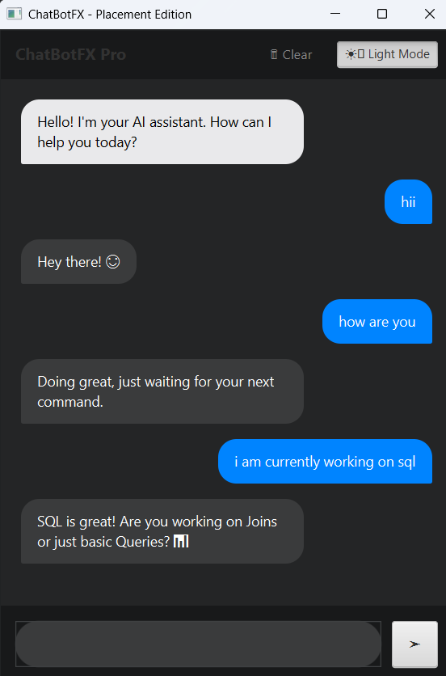
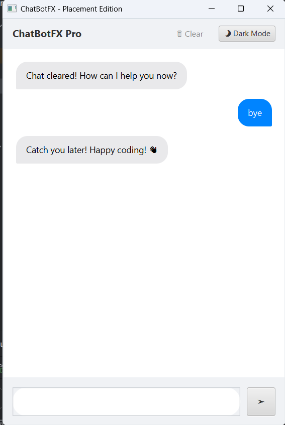

# 🤖 ChatBotFX – Smart JavaFX Chat Application

## 🚀 Overview
ChatBotFX is a modern desktop chatbot built using JavaFX.  
It provides a smooth and interactive chat experience with a clean UI, typing effects, and intelligent responses.

This project was developed as part of the CodeAlpha Java Internship.

---

## ✨ Features
- 💬 Chat bubble UI (like real messaging apps)
- 🌙 Dark / Light mode toggle
- ⌨️ Enter key support
- 🤖 Smart rule-based chatbot logic
- ⏳ Typing indicator (realistic delay)
- 🧹 Clear chat functionality
- 📜 Auto-scroll for new messages
- 🎨 Modern and responsive UI design

---

## 🛠️ Tech Stack
- Java 17
- JavaFX
- IntelliJ IDEA

---

## ▶️ How to Run
1. Clone the repository  
2. Open in IntelliJ IDEA  
3. Add JavaFX SDK to project  
4. Run `Main.java`  

---

## 📸 Screenshots

### 💬 Chat UI

### 🌙 Dark Mode

### 🧹 Clear Chat

---

## 📌 Internship Task
This project was developed as part of the **CodeAlpha Java Internship (Task 1: AI Chatbot)**.

---

## 🚀 Future Improvements
- Integration with AI APIs (Gemini / OpenAI)
- Save chat history
- Message timestamps
- UI animations

---

## 👨‍💻 Author
**Shubham Nikhode**
